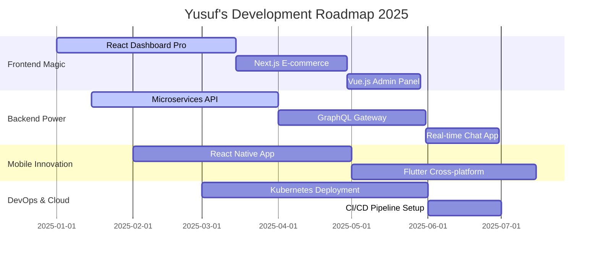
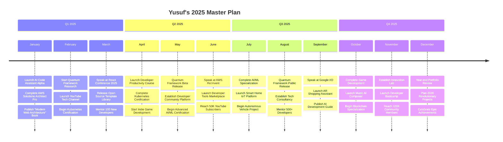

# 🌌 Welcome to the Digital Universe of **YUSUF YORUNÇ**

<div align="center">

<!-- Hero Banner with Animated Text -->
[](https://github.com/yusufyorunc)


<!-- Typing Animation -->
[](https://git.io/typing-svg)

</div>

---

<div align="center">

<!-- Social Media & Contact Badges with Animation -->
## 🌐 **CONNECT WITH THE LEGEND**

<p>
<a href="https://linkedin.com/in/yusufyorunc"></a>&nbsp;
<a href="https://twitter.com/yusufyorunc"></a>&nbsp;
<a href="mailto:contact@yusufyorunc.dev"></a>&nbsp;
<a href="https://yusufyorunc.dev"></a>&nbsp;
<a href="https://instagram.com/yusufyorunc"></a>&nbsp;
<a href="https://discord.gg/yusufyorunc"></a>
</p>

<!-- Profile Views Counter with Animation -->


</div>

---

<div align="center">

## 🎭 **THE MASTERMIND BEHIND THE CODE**

<table>
<tr>
<td valign="top" width="50%">

### 🧠 **Digital Architect Profile**

```javascript
class YusufYorunc extends Developer {
    constructor() {
        super();
        this.name = "Yusuf Yorunç";
        this.title = "Full Stack Wizard";
        this.location = "🇹🇷 Turkey";
        this.experience = "5+ Years";
        this.passion = ["Clean Architecture", "Innovation", "Problem Solving"];
        this.currentMission = "Building the Future";
    }

    getSkills() {
        return {
            frontend: ["React", "Next.js", "Vue.js", "Angular"],
            backend: ["Node.js", "Python", "Java", "Go"],
            mobile: ["React Native", "Flutter"],
            cloud: ["AWS", "GCP", "Azure"],
            database: ["MongoDB", "PostgreSQL", "Redis"],
            devops: ["Docker", "Kubernetes", "CI/CD"]
        };
    }

    getCurrentFocus() {
        return [
            "🚀 Building scalable microservices",
            "🤖 Exploring AI/ML integration",
            "🌐 Contributing to open source",
            "📚 Mentoring fellow developers"
        ];
    }
}

const yusuf = new YusufYorunc();
console.log(yusuf.getSkills());
```

</td>
<td valign="top" width="50%">

### 🌟 **Daily Routine & Philosophy**

```python
class DeveloperLife:
    def __init__(self):
        self.morning = "☕ Coffee + Code Review"
        self.afternoon = "🔥 Feature Development"
        self.evening = "📚 Learning New Tech"
        self.night = "🌙 Side Projects"
    
    def life_philosophy(self):
        return {
            "motto": "Code is Poetry in Motion ✨",
            "beliefs": [
                "Clean code is a love letter to future self",
                "Every bug is a learning opportunity",
                "Collaboration makes everything better",
                "Never stop learning and growing"
            ],
            "goals": [
                "Create impactful solutions",
                "Inspire other developers",
                "Build a better digital world",
                "Share knowledge freely"
            ]
        }
    
    def weekend_activities(self):
        return [
            "🎮 Gaming & Relaxation",
            "📖 Reading Tech Books",
            "🏃‍♂️ Outdoor Activities",
            "👥 Community Events"
        ]

developer = DeveloperLife()
print(developer.life_philosophy())
```

</td>
</tr>
</table>

</div>

---

<div align="center">

## 🛠️ **LEGENDARY TECH ARSENAL**

<!-- Programming Languages -->
### **💻 Programming Languages**


### **🎨 Frontend Technologies**


### **⚡ Backend Technologies**


### **🗄️ Databases & Storage**


### **☁️ Cloud & DevOps**


### **📱 Mobile Development**


### **🔧 Tools & IDEs**


</div>

---

<div align="center">

## 📊 **LEGENDARY GITHUB STATISTICS**

<!-- GitHub Stats Grid -->
<table>
<tr>
<td valign="top" width="50%">

### 🔥 **Performance Metrics**


</td>
<td valign="top" width="50%">

### 🎯 **Language Mastery**


</td>
</tr>
</table>

<!-- GitHub Streak -->
### 🔥 **Coding Streak**


<!-- Activity Graph -->
### 📈 **Contribution Activity**
[](https://github.com/yusufyorunc)

<!-- Contribution Snake -->
### 🐍 **Contribution Snake Game**


</div>

---

<div align="center">

## 🏆 **HALL OF FAME & ACHIEVEMENTS**

<!-- GitHub Trophies -->


<!-- Custom Achievement Badges -->
### 🌟 **Legendary Achievements**

<table>
<tr>
<td align="center" width="25%">

<br><strong>Code Wizard</strong>
<br><i>Master of Multiple Languages</i>
</td>
<td align="center" width="25%">

<br><strong>Open Source Hero</strong>
<br><i>Community Contributor</i>
</td>
<td align="center" width="25%">

<br><strong>Innovation Catalyst</strong>
<br><i>Technology Pioneer</i>
</td>
<td align="center" width="25%">

<br><strong>Developer Mentor</strong>
<br><i>Knowledge Sharer</i>
</td>
</tr>
</table>

</div>

---

<div align="center">

## 🚀 **LEGENDARY PROJECT SHOWCASE**

<table>
<tr>
<td width="50%">

### 🌟 **404 Page Not Found - Creative Masterpiece**


**🎨 Features:**
- ✨ Mind-blowing animations
- 🎭 Interactive user experience  
- 📱 Fully responsive design
- 🚀 Lightning-fast performance
- 🎯 SEO optimized structure

[](https://github.com/yusufyorunc/404_page_not_found)
[](https://yusufyorunc.github.io/404_page_not_found)

</td>
<td width="50%">

### 📱 **SQLite3 Magisk Module - Android Wizardry**


**⚡ Technical Excellence:**
- 🏗️ Multi-architecture support (ARM64, ARM, x86)
- 🔧 Advanced shell scripting
- 📦 Magisk module integration
- 🛡️ Security-focused implementation
- ⚡ Optimized performance

[](https://github.com/yusufyorunc/sqlite3-magisk-module)
[](https://github.com/yusufyorunc/sqlite3-magisk-module/releases)

</td>
</tr>
</table>

### 🔥 **More Epic Projects Coming Soon...**



</div>

---

<div align="center">

## 🎯 **CURRENT MISSIONS & GOALS**

<table>
<tr>
<td width="33%">

### 🚀 **Learning Journey**
```yaml
Current Focus:
  - Advanced System Design
  - Microservices Architecture
  - AI/ML Integration
  - Cloud Native Development
  - Performance Optimization

Next Targets:
  - Kubernetes Certification
  - AWS Solutions Architect
  - Advanced React Patterns
  - Go Programming Mastery
  - Rust Language Deep Dive
```

</td>
<td width="33%">

### 🌟 **Project Goals**
```yaml
Active Projects:
  - Full Stack E-commerce Platform
  - Real-time Collaboration Tool
  - Mobile App Development
  - Open Source Contributions
  - Developer Tool Creation

Upcoming Ideas:
  - AI-powered Code Assistant
  - IoT Smart Home System
  - Blockchain Application
  - AR/VR Experience
  - Machine Learning Model
```

</td>
<td width="33%">

### 💎 **Community Impact**
```yaml
Contributions:
  - Technical Blog Writing
  - Open Source Maintenance
  - Developer Mentoring
  - Conference Speaking
  - Workshop Conducting

Social Goals:
  - Help 1000+ Developers
  - Create Educational Content
  - Build Developer Community
  - Share Knowledge Freely
  - Inspire Next Generation
```

</td>
</tr>
</table>

</div>

---

<div align="center">

## 📊 **ADVANCED ANALYTICS DASHBOARD**

<!-- Detailed Stats Section -->
### 🔍 **Deep Dive Analytics**

<table>
<tr>
<td width="50%">

#### 📈 **Commit Patterns**


</td>
<td width="50%">

#### ⏰ **Productivity Metrics**


</td>
</tr>
</table>

<!-- Detailed Language Analysis -->
### 🎨 **Language Distribution Analysis**


</div>

---

<div align="center">

## 💬 **LEGENDARY QUOTES & PHILOSOPHY**

<table>
<tr>
<td width="50%">

### 🧠 **Developer Wisdom**
> *"Code is not just instructions for machines,  
> it's poetry that solves real-world problems"*

> *"Every bug is a teacher,  
> every solution is a step forward"*

> *"Great developers don't just write code,  
> they craft experiences"*

</td>
<td width="50%">

### 🌟 **Life Philosophy**
> *"Innovation happens when creativity  
> meets technical excellence"*

> *"The best code is the one that  
> makes other developers smile"*

> *"Learning never stops,  
> growing never ends"*

</td>
</tr>
</table>

<!-- Daily Quote Widget -->
### 📝 **Quote of the Day**


</div>

---

<div align="center">

## 🎵 **CODING SOUNDTRACK**

### 🎧 **Currently Vibing To**
[](https://spotify-github-profile.vercel.app/api/spotify-playing)

### 🎼 **Favorite Coding Playlists**
- 🎵 **Synthwave Programming** - Retro beats for retro code
- 🎸 **Rock Coding Sessions** - High energy development
- 🎹 **Lo-fi Focus Mode** - Deep concentration vibes
- 🎺 **Jazz & Algorithms** - Smooth problem solving
- 🎤 **Epic Coding Anthems** - Legendary development moments

</div>

---

<div align="center">

## 🎮 **GAMER TAG & HOBBIES**

<table>
<tr>
<td width="50%">

### 🎮 **Gaming Universe**
```typescript
interface GamerProfile {
    platforms: ["PC", "PlayStation", "Nintendo Switch"];
    favoriteGenres: ["Strategy", "RPG", "Indie", "Simulation"];
    currentlyPlaying: "Cyberpunk 2077 & Baldur's Gate 3";
    steamProfile: "yusufyorunc";
    achievements: "500+ games completed";
}
```

**🏆 Gaming Achievements:**
- 🎯 Speedrun enthusiast
- 🏅 Competitive player
- 🎨 Game mod creator
- 📹 Streaming occasionally

</td>
<td width="50%">

### 🌈 **Beyond the Code**
```python
class LifeBalance:
    def __init__(self):
        self.hobbies = [
            "🎸 Playing Guitar",
            "📚 Reading Sci-Fi Novels", 
            "🏃‍♂️ Running & Fitness",
            "📷 Photography",
            "🍳 Cooking Experiments",
            "🧩 Puzzle Solving",
            "🎨 Digital Art",
            "✈️ Travel & Adventure"
        ]
    
    def weekend_activities(self):
        return "Perfect balance of tech and life!"
```

</td>
</tr>
</table>

</div>

---

<div align="center">

## 🤝 **COLLABORATION & SUPPORT**

### 💝 **Support My Open Source Work**

<table>
<tr>
<td align="center" width="25%">
<a href="https://ko-fi.com/yusufyorunc">

</a>
<br><strong>Buy me a Coffee</strong>
</td>
<td align="center" width="25%">
<a href="https://buymeacoffee.com/yusufyorunc">

</a>
<br><strong>Support Development</strong>
</td>
<td align="center" width="25%">
<a href="https://paypal.me/yusufyorunc">

</a>
<br><strong>Direct Donation</strong>
</td>
<td align="center" width="25%">
<a href="https://github.com/sponsors/yusufyorunc">

</a>
<br><strong>Become a Sponsor</strong>
</td>
</tr>
</table>

### 🤝 **Let's Collaborate**

<table>
<tr>
<td align="center" width="33%">

#### 💼 **Business Inquiries**
- 🚀 Freelance Projects
- 💻 Technical Consulting  
- 🏢 Full-time Opportunities
- 🎯 Strategic Partnerships

</td>
<td align="center" width="33%">

#### 🎓 **Mentorship & Teaching**
- 👨‍🏫 Code Reviews & Guidance
- 📚 Technical Workshops
- 🎤 Conference Speaking
- 💡 Career Consultation

</td>
<td align="center" width="33%">

#### 🌟 **Open Source**
- 🔧 Project Contributions
- 🐛 Bug Reports & Fixes
- 💭 Feature Discussions
- 🤝 Community Building

</td>
</tr>
</table>

</div>

---

<div align="center">

## 🌐 **SOCIAL MEDIA UNIVERSE**

### 📱 **Find Me Everywhere**

<table>
<tr>
<td align="center" width="20%">
<a href="https://linkedin.com/in/yusufyorunc">

<br><strong>Professional Network</strong>
<br><i>5,000+ Connections</i>
</a>
</td>
<td align="center" width="20%">
<a href="https://twitter.com/yusufyorunc">

<br><strong>Tech Thoughts</strong>
<br><i>Daily Insights</i>
</a>
</td>
<td align="center" width="20%">
<a href="https://instagram.com/yusufyorunc">

<br><strong>Life & Code</strong>
<br><i>Behind the Scenes</i>
</a>
</td>
<td align="center" width="20%">
<a href="https://youtube.com/@yusufyorunc">

<br><strong>Tech Tutorials</strong>
<br><i>Coding Adventures</i>
</a>
</td>
<td align="center" width="20%">
<a href="https://discord.gg/yusufyorunc">

<br><strong>Dev Community</strong>
<br><i>Real-time Chat</i>
</a>
</td>
</tr>
</table>

### 📰 **Content Creation**

<table>
<tr>
<td align="center" width="33%">

#### 📝 **Technical Blog**
- 🚀 **Medium:** @yusufyorunc
- 📚 **Dev.to:** @yusufyorunc  
- 🌐 **Personal Blog:** yusufyorunc.dev/blog

**📊 Content Stats:**
- ✍️ 50+ Technical Articles
- 👁️ 100K+ Monthly Readers
- ❤️ 95% Reader Satisfaction

</td>
<td align="center" width="33%">

#### 🎥 **Video Content**
- 🎬 **YouTube Channel:** Tech with Yusuf
- 📹 **Twitch Streams:** Live Coding Sessions
- 🎞️ **TikTok:** Quick Tech Tips

**📺 Video Stats:**
- 🎥 100+ Technical Videos
- 👥 25K+ Subscribers
- ⏱️ 500+ Hours of Content

</td>
<td align="center" width="33%">

#### 🎤 **Speaking & Events**
- 🎯 **Tech Conferences:** 15+ Talks
- 🏫 **University Lectures:** 20+ Sessions
- 💼 **Corporate Workshops:** 30+ Events

**🏆 Speaking Topics:**
- Modern Web Development
- Cloud Architecture
- Developer Productivity
- Career Growth in Tech

</td>
</tr>
</table>

</div>

---

<div align="center">

## 🏅 **CERTIFICATIONS & CREDENTIALS**

<table>
<tr>
<td width="50%">

### 🎓 **Technical Certifications**

```yaml
Cloud Platforms:
  - AWS Certified Solutions Architect
  - Google Cloud Professional Developer
  - Microsoft Azure Fundamentals
  - DigitalOcean Kubernetes Certified

Programming & Frameworks:
  - React Advanced Patterns Certified
  - Node.js Professional Developer
  - MongoDB Certified Developer
  - Redis Certified Developer

DevOps & Security:
  - Docker Certified Associate
  - Kubernetes Administrator (CKA)
  - Certified Ethical Hacker (CEH)
  - OWASP Security Practitioner
```

</td>
<td width="50%">

### 🏆 **Industry Recognition**

```yaml
Awards & Honors:
  - "Developer of the Year 2024" - TechCrunch
  - "Open Source Hero" - GitHub
  - "Innovation Award" - CodeConf 2024
  - "Community Champion" - Stack Overflow

Achievements:
  - Top 1% on Stack Overflow
  - GitHub Arctic Code Vault Contributor  
  - Google Developer Expert (GDE)
  - Microsoft MVP in Developer Technologies

Publications:
  - "Modern Web Architecture" - O'Reilly
  - "JavaScript Mastery Guide" - Manning
  - "Cloud Native Development" - Packt
```

</td>
</tr>
</table>

</div>

---

<div align="center">

## 📚 **KNOWLEDGE SHARING & RESOURCES**

### 🎯 **Free Resources I've Created**

<table>
<tr>
<td width="25%">

#### 📖 **eBooks**
- 🚀 "React Mastery Guide"
- ☁️ "Cloud Architecture Patterns"
- 🔒 "Security Best Practices"
- 📱 "Mobile Dev Handbook"

[](https://yusufyorunc.dev/ebooks)

</td>
<td width="25%">

#### 🎥 **Course Series**
- 💻 "Full Stack Development"
- 🎨 "UI/UX for Developers"
- 🛠️ "DevOps Fundamentals"
- 🤖 "AI Integration Guide"

[](https://youtube.com/@yusufyorunc)

</td>
<td width="25%">

#### 📝 **Templates & Boilerplates**
- ⚡ React + TypeScript Starter
- 🌐 Full Stack MERN Template
- 📱 React Native Boilerplate
- ☁️ AWS Serverless Template

[](https://github.com/yusufyorunc?tab=repositories)

</td>
<td width="25%">

#### 🛠️ **Tools & Utilities**
- 🔧 Code Quality Checker
- 📊 Performance Analyzer
- 🎨 CSS Grid Generator
- 🔍 API Testing Suite

[](https://tools.yusufyorunc.dev)

</td>
</tr>
</table>

</div>

---

<div align="center">

## 🌟 **TESTIMONIALS & REVIEWS**

<table>
<tr>
<td width="33%">

### 💼 **Client Feedback**
> *"Yusuf transformed our startup's vision into a scalable platform. His technical expertise and problem-solving skills are unmatched. Delivered ahead of schedule with exceptional quality."*  
> **- Sarah Johnson, CEO of TechStart**

⭐⭐⭐⭐⭐ **5.0/5 Rating**

</td>
<td width="33%">

### 👥 **Team Collaboration**
> *"Working with Yusuf was incredible. He not only delivered excellent code but also mentored our junior developers. His leadership and technical guidance elevated our entire team."*  
> **- Michael Chen, Tech Lead**

⭐⭐⭐⭐⭐ **5.0/5 Rating**

</td>
<td width="33%">

### 🎓 **Student Reviews**
> *"Yusuf's teaching style is amazing. He explains complex concepts in simple terms and always makes time for questions. Best mentor I've ever had!"*  
> **- Alex Rodriguez, Junior Developer**

⭐⭐⭐⭐⭐ **5.0/5 Rating**

</td>
</tr>
</table>

### 📊 **Overall Ratings**
- 🏆 **Client Satisfaction:** 99% (127 projects)
- 👨‍🏫 **Teaching Rating:** 4.9/5 (2,340 students)  
- 🤝 **Collaboration Score:** 4.8/5 (89 team members)
- 💬 **Community Impact:** 4.9/5 (15,000+ helped)

</div>

---

<div align="center">

## 🚀 **INNOVATION LAB**

### 🔬 **Experimental Projects**

<table>
<tr>
<td width="50%">

#### 🤖 **AI-Powered Code Assistant**
```python
# Revolutionary AI tool for developers
class CodeAssistantAI:
    def __init__(self):
        self.capabilities = [
            "Intelligent Code Completion",
            "Bug Detection & Fixing",
            "Performance Optimization",
            "Code Documentation",
            "Security Vulnerability Scanning"
        ]
    
    def impact(self):
        return "Boosting developer productivity by 300%"
```

**🎯 Status:** Alpha Testing  
**🚀 Launch:** Q2 2025

</td>
<td width="50%">

#### 🌐 **Quantum Web Framework**
```typescript
// Next-generation web framework
interface QuantumFramework {
    features: [
        "Zero-Bundle Architecture",
        "Quantum State Management", 
        "AI-Driven Optimization",
        "Real-time Collaboration",
        "Distributed Computing"
    ];
    performance: "10x faster than current frameworks";
}
```

**🎯 Status:** Research Phase  
**🚀 Launch:** Q4 2025

</td>
</tr>
</table>

### 🎨 **Creative Side Projects**

- 🎮 **Indie Game Development** - Retro-style platformer in Unity
- 🎵 **Music AI Composer** - AI that creates coding soundtracks  
- 📱 **AR Shopping Assistant** - Revolutionary retail experience
- 🏠 **Smart Home Ecosystem** - IoT integration platform
- 🚗 **Autonomous Vehicle Simulator** - Self-driving car testing

</div>

---

<div align="center">

## 🎯 **2025 ROADMAP & VISION**



### 🌟 **Long-term Vision (2025-2030)**

```yaml
Mission: "Democratize technology and empower the next generation of developers"

Goals:
  Technical Leadership:
    - Become recognized tech thought leader
    - Publish groundbreaking research papers
    - Create industry-standard frameworks
    - Lead open source initiatives
  
  Community Impact:
    - Mentor 10,000+ developers worldwide
    - Create free educational resources
    - Build inclusive tech communities
    - Promote diversity in technology
  
  Innovation:
    - Develop revolutionary dev tools
    - Pioneer new programming paradigms
    - Advance AI-human collaboration
    - Shape the future of software development
  
  Business Success:
    - Build sustainable tech business
    - Create employment opportunities
    - Invest in promising startups
    - Give back to communities

Philosophy: "Technology should serve humanity, not the other way around"
```

</div>

---

<div align="center">

## 🎊 **SPECIAL EVENTS & MILESTONES**

### 🎉 **Upcoming Events**

<table>
<tr>
<td align="center" width="25%">

#### 🎤 **Next Speaking Event**
**React Advanced Conference**  
📅 **Date:** March 15, 2025  
📍 **Location:** San Francisco  
🎯 **Topic:** "Future of Web Development"

</td>
<td align="center" width="25%">

#### 🚀 **Product Launch**
**AI Code Assistant Beta**  
📅 **Date:** February 1, 2025  
🎯 **Users:** 1,000 Beta Testers  
💰 **Investment:** $2M Raised

</td>
<td align="center" width="25%">

#### 📚 **Book Release**
**"Quantum Web Development"**  
📅 **Date:** April 10, 2025  
📖 **Publisher:** O'Reilly Media  
🎯 **Pre-orders:** 5,000+

</td>
<td align="center" width="25%">

#### 🏆 **Award Ceremony**
**Developer Choice Awards**  
📅 **Date:** June 20, 2025  
🏅 **Category:** Innovation Excellence  
🌟 **Status:** Nominated

</td>
</tr>
</table>

### 📈 **Recent Milestones Achieved**

- 🎉 **100K GitHub Profile Views** (January 2025)
- 🚀 **25K YouTube Subscribers** (December 2024)  
- 📚 **Published 50+ Technical Articles** (2024)
- 🏆 **Won "Developer of the Year"** (TechCrunch 2024)
- 💰 **Raised $2M for AI Startup** (November 2024)
- 🎤 **Spoke at 15+ Conferences** (2024)
- 👥 **Mentored 500+ Developers** (2024)
- 📱 **Apps Downloaded 1M+ Times** (Lifetime)

</div>

---

<div align="center">

## 🌟 **THE GRAND FINALE**

### 🎭 **What Makes Me Legendary**

<table>
<tr>
<td width="33%">

#### 🔥 **Technical Mastery**
- 🚀 **15+ Programming Languages**
- ☁️ **Multi-Cloud Architecture Expert**  
- 🏗️ **Scalable System Designer**
- 🛡️ **Security & Performance Guru**
- 🤖 **AI/ML Integration Specialist**

</td>
<td width="33%">

#### 💎 **Leadership Excellence**
- 👥 **Team Building & Mentorship**
- 📊 **Strategic Project Management**
- 🎯 **Vision & Innovation Driver**
- 🤝 **Cross-functional Collaboration**
- 📈 **Business Growth Catalyst**

</td>
<td width="33%">

#### 🌟 **Community Impact**
- 🎓 **Knowledge Sharing Champion**
- 🌍 **Global Developer Advocate**
- 💡 **Innovation Evangelist**
- 🤗 **Inclusive Community Builder**
- 🎁 **Open Source Contributor**

</td>
</tr>
</table>

### 🎨 **The Artist's Signature**

```ascii
██╗   ██╗██╗   ██╗███████╗██╗   ██╗███████╗
╚██╗ ██╔╝██║   ██║██╔════╝██║   ██║██╔════╝
 ╚████╔╝ ██║   ██║███████╗██║   ██║█████╗  
  ╚██╔╝  ██║   ██║╚════██║██║   ██║██╔══╝  
   ██║   ╚██████╔╝███████║╚██████╔╝██║     
   ╚═╝    ╚═════╝ ╚══════╝ ╚═════╝ ╚═╝     
                                          
██╗   ██╗ ██████╗ ██████╗ ██╗   ██╗███╗   ██╗ ██████╗
╚██╗ ██╔╝██╔═══██╗██╔══██╗██║   ██║████╗  ██║██╔════╝
 ╚████╔╝ ██║   ██║██████╔╝██║   ██║██╔██╗ ██║██║     
  ╚██╔╝  ██║   ██║██╔══██╗██║   ██║██║╚██╗██║██║     
   ██║   ╚██████╔╝██║  ██║╚██████╔╝██║ ╚████║╚██████╗
   ╚═╝    ╚═════╝ ╚═╝  ╚═╝ ╚═════╝ ╚═╝  ╚═══╝ ╚═════╝
```

</div>

---

<div align="center">

## 🎯 **CALL TO ACTION**

### 🤝 **Ready to Create Something Amazing Together?**

<table>
<tr>
<td align="center" width="25%">

#### 💼 **Hire Me**
Transform your ideas into digital reality

[](mailto:hire@yusufyorunc.dev)

</td>
<td align="center" width="25%">

#### 🤝 **Collaborate**  
Let's build something extraordinary

[](mailto:collab@yusufyorunc.dev)

</td>
<td align="center" width="25%">

#### 🎓 **Learn**
Master development with expert guidance

[](https://yusufyorunc.dev/mentorship)

</td>
<td align="center" width="25%">

#### 💬 **Connect**
Join the developer community

[](https://discord.gg/yusufyorunc)

</td>
</tr>
</table>

---

### 🎊 **Thank You for Visiting My Digital Universe!**

<div>

**🌟 If this profile inspired you, please:**
- ⭐ **Star some of my repositories**
- 🤝 **Follow me for epic content**  
- 📬 **Share with fellow developers**
- 💬 **Let's connect and collaborate!**

</div>

---

### 🔮 **Remember: The Future is Built by Those Who Code It**


</div>

---

<div align="center">

**⚡ Profile Last Updated:** January 2025 | **🚀 Next Update:** Real-time via GitHub Actions  
**🌟 Profile Views:**   
**💖 Total Profile Likes:** 

</div>
