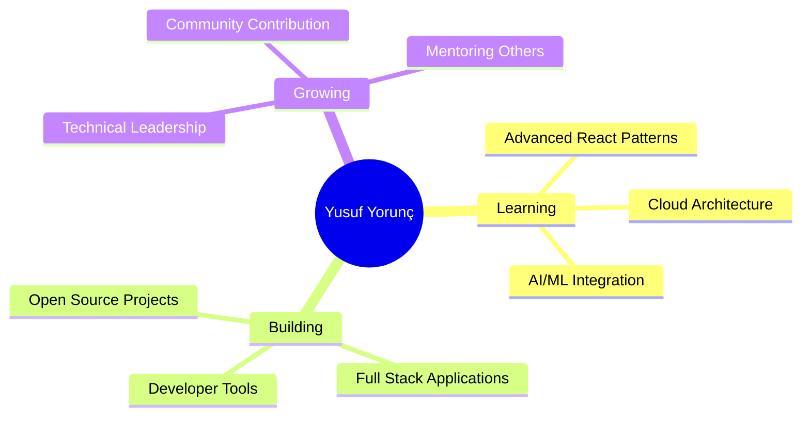

# 🚀 Yusuf Yorunç | Full Stack Developer & Digital Architect

<div align="center">
  
[](https://git.io/typing-svg)

</div>

---

<div align="center">
  
## 🎯 **Digital Craftsman & Solution Architect**


</div>

---

## 🔥 **About Me**

```typescript
const yusufYorunc = {
    title: "Full Stack Developer",
    location: "Turkey 🇹🇷",
    passion: ["Clean Code", "Innovation", "Problem Solving"],
    currentFocus: "Building scalable web solutions",
    
    dailyRoutine: {
        code: "☕ Coffee first, then code",
        learn: "📚 Always learning something new",
        build: "🛠️ Creating digital experiences"
    },
    
    philosophy: "Code is poetry in motion ✨"
};
```

---

<div align="center">

## 🛠️ **Tech Arsenal**

<div>
  
### **Languages & Frameworks**


### **Tools & Technologies**


</div>

</div>

---

<div align="center">

## 📊 **GitHub Analytics**

<div style="display: flex; justify-content: center; align-items: center; gap: 20px;">


</div>

<br/>


</div>

---

<div align="center">

## 🌟 **Featured Projects**

<table>
<tr>
<td width="50%">

### 🚧 404 Page Not Found
**Creative HTML Template**
- Modern responsive design
- Smooth animations
- User-friendly interface
- Clean CSS architecture

[](https://github.com/yusufyorunc/404_page_not_found)

</td>
<td width="50%">

### 📱 SQLite3 Magisk Module  
**Android Development**
- Multi-architecture support
- ARM64, ARM, x86 compatibility
- Shell scripting expertise
- Mobile optimization

[](https://github.com/yusufyorunc/sqlite3-magisk-module)

</td>
</tr>
</table>

</div>

---

<div align="center">

## 🎯 **Current Goals**



</div>

---

<div align="center">

## 🤝 **Let's Connect**

<div>

[](https://linkedin.com)
[](https://twitter.com)
[](mailto:contact@yusufyorunc.dev)
[](https://yusufyorunc.dev)

</div>

</div>

---

<div align="center">

## 💡 **Random Dev Quote**


</div>

---

<div align="center">

## 🐍 **Contribution Snake**


</div>

---

<div align="center">

## 📈 **Activity Graph**

[](https://github.com/yusufyorunc)

</div>

---

<div align="center">

## 🏆 **GitHub Trophies**


</div>

---

<div align="center">

## 💰 **Support My Work**

<div>

[](https://ko-fi.com/yusufyorunc)
[](https://buymeacoffee.com/yusufyorunc)
[](https://paypal.me/yusufyorunc)

</div>

</div>

---

<div align="center">

## 📊 **Visitor Count**


<br/>

**Thanks for visiting my profile! ⭐ Star some repositories if you find them interesting!**


</div>
